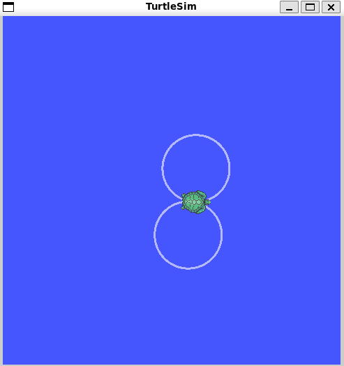

# Paczka ROS 2 - turtle_eight

Projekt w ROS 2, którego celem jest sterowanie żółwiem w `turtlesim`, by poruszał się on po torze w kształcie ósemki.

## Wynik końcowy

W tym miejscu warto dodać zrzut ekranu przedstawiający końcowy efekt działania programu (narysowaną ósemkę).

**Jak dodać zrzut ekranu:**


## Wymagania

*   System operacyjny Ubuntu 22.04
*   ROS 2 Humble Hawksbill
*   Pakiet `turtlesim`

## Instalacja i Budowanie

1.  **Stwórz workspace:**
    ```bash
    mkdir -p turtle_eight_ws/src
    cd turtle_eight_ws/src
    ```

2.  **Sklonuj repozytorium do folderu `src`:**
    ```bash
    # UWAGA: Poniższy link należy zastąpić linkiem do WŁASNEGO repozytorium!
    git clone https://github.com/your_name/your_repo.git
    ```

3.  **Wróć do głównego katalogu workspace'u i zbuduj projekt:**
    ```bash
    cd ..
    colcon build
    ```

## Uruchomienie

Do uruchomienia projektu potrzebne są **dwa osobne terminale**. W obu należy znajdować się w głównym folderze workspace (`turtle_eight_ws`).

#### **Terminal 1: Uruchomienie symulatora `turtlesim`**

```bash
# "Zasourcuj" środowisko ROS 2
source install/setup.bash

# Uruchom węzeł symulatora
ros2 run turtlesim turtlesim_node
```
Okno pozostaw je otwarte.

#### **Terminal 2: Uruchomienie węzła sterującego `turtle_eight`**

```bash
# "Zasourcuj" środowisko ROS 2 w tym terminalu również
source install/setup.bash

# Uruchom swój węzeł, który steruje żółwiem
ros2 run turtle_eight infinity_loop_node
```
Po wykonaniu tej komendy żółw w oknie symulatora powinien zacząć poruszać się po torze w kształcie ósemki.

---

## Sprawozdanie: Opis podejścia i zastosowane algorytmy

### Główna koncepcja

Kształt ósemki (znak nieskończoności) można matematycznie opisać jako dwa przylegające do siebie okręgi, gdzie jeden jest pokonywany zgodnie z ruchem wskazówek zegara, a drugi przeciwnie.

Algorytm sterowania opiera się na tej prostej zasadzie. Aby zmusić żółwia do poruszania się po okręgu, należy nadać mu jednocześnie stałą prędkość liniową (do przodu) oraz stałą prędkość kątową (obrót).

### Implementacja w węźle ROS 2

1.  **Struktura węzła**: Węzeł `infinity_loop_node` został zaimplementowany w Pythonie przy użyciu biblioteki `rclpy`. Węzeł tworzy wydawcę (publisher), który publikuje wiadomości typu `geometry_msgs/msg/Twist` na temat (topic) `/turtle1/cmd_vel`. Symulator `turtlesim` subskrybuje ten temat i na podstawie otrzymanych wiadomości steruje ruchem żółwia.

2.  **Logika sterowania**:
    *   Główna pętla sterująca jest realizowana za pomocą Timera, który cyklicznie wywołuje funkcję odpowiedzialną za publikowanie wiadomości.
    *   Ruch po ósemce został podzielony na dwa etapy, które naprzemiennie się wykonują:
        1.  **Pierwszy okrąg**: Przez określony czas (wystarczający do wykonania pełnego obrotu o 360 stopni) publikowana jest wiadomość `Twist` z dodatnią prędkością liniową `linear.x` i dodatnią prędkością kątową `angular.z`.
        2.  **Drugi okrąg**: Po zakończeniu pierwszego etapu, znak prędkości kątowej jest odwracany. Przez taki sam okres publikowana jest wiadomość `Twist` z tą samą prędkością `linear.x`, ale z ujemną prędkością `angular.z`.

## Licencja

Ten projekt jest udostępniany na licencji Apache License 2.0.
